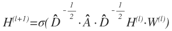
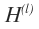
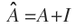
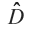
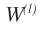
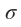
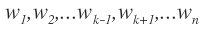
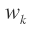

## graph convolutional network(GCN)
- paper: Semi-Supervised Classification with Graph Convolutional Networks(https://arxiv.org/abs/1609.02907)
- in CNN, we share filter(kernel) - every region in input image share weights in filter(kernel)
- likely, in GCN, all input nodes in graph share weights in current layer
- input: node input features(NxC), adjacent matrix(NxN)
- output: node embedding(NxD)
- learnable params: weights in each layer l(FxF')(input F, output F')
- forward propagation as follows 
    - : hidden feature vectors in lth layer, (NxF)
    - : A is adjacent matrix and I is identity matrix. By adding I, we can consider self loop. (NxN)
    - : diagonal degree matrix of . Above equation applies symmetric normalization of A because pure multiplication of A and H magnifies the scale.
    - : weights in lth layer. All hidden features of nodes in lth layer share this weights, (FxF')
    - : activation function such as ReLU

## Graph Representation Learning
- motivation of graph representation learning
    - machine learning => feature extraction => map input data x to feature vector v
    - in graph(V, E), each node has its own feature(input feature, e.g. age, sex, height...) and graph topology gives another feature(e.g. James and Mike are friend)
    - we want to find graph topology as a latent feature of each node, namely, map each node to feature vector v learned by edge of graph(then, we can apply various ML algorithms) => this is called `network encoding, network embedding`
    - beacuase each encoding value is vector, we can calculate similarity between encodings and it(e.g. similarity) indicates link strength between nodes
    - but network embedding is hard beacuse network is not fixed-size structure
        - images are fixed sizes
        - text has various length but because it is linear, we can use moving window
        - graph has any number of nodes and any link between nodes => `much more complicated structure`
    - conclusion
        - graph embedding is a method that encode graph connectivity(e.g. adjacent matrix)
        - graph embedding is a hard procedure beacuse graph is not fixed-size and complicated structure
        - graph embedding is important because graph can represent various real word problem(e.g. social media network such as facebook, instagram...)

- graph embedding method: Deep Walk
    - deep walk = random walk + word2vec
        - random walk
            - from source node, randomly move to its adjacent node 't' times => this makes vector of length 't' whose element is node
        - word2vec
            - word2vec is a method of embedding word to vector
            - assumption: if 2 words appear frequently, they may be similar
            - word2vec maps similar words to similar vector
            - word2vec = cobw + skip-gram
                - cbow(continuous bag of words)
                    - given: 
                    - predict: 
                - skip-gram
                    - given: 
                    - predict: 
        - deepwalk
            - by using random walk from u, find u's neighbor, and this is considered as sentence
            - each node is considered as node
            - by using word2vec, embed node into d-dimension vector
    - input: adjacent matrix A(nxn)
    - output: feature matrix F(nxd)

- node2vec
    - goal: embed nodes with similar network neighbors close in feature space(비슷한 인접노드를 갖는 노드들을 feature space에서 가깝도록 embedding함)
        - biased 2nd order random walk를 이용하여 node u로부터의 neighbor N(u)를 구함
        - neighbor N(u)를 sentence of words로 보고 word2vec을 이용하여 similar node가 similar embedding을 갖도록 함

- node2vec vs deepwalk
    - in deepwalk, we find neighbors of node u using random walk
    - in node2vec, we find neighbors of node u using biased 2nd oreder random walk
    - thus, method of finding neighbors is different

- graph neural network
    - transductive model vs inductive model
        - assumption: in node classification problem, each node in trainset and testset has it's label
        - `transductive model` usesnot only nodes in trainset but also nodes in testset except label of nodes in testset. we do transductive learning because if we exclude nodes in testset, then if inference time, we should extend out graph structure, which is really hard
        - `inductive model` is, as same with traditional supervised learning, train using labeled examples and testing using completely new unlabeled data. this implies in graph that we should predict based on completely unseen graph structures 

