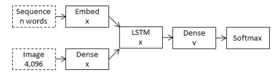
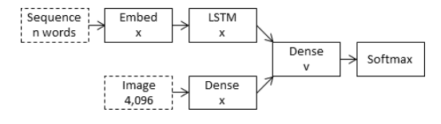
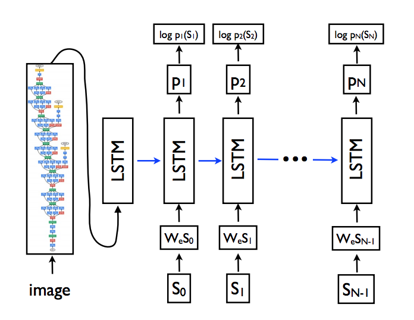
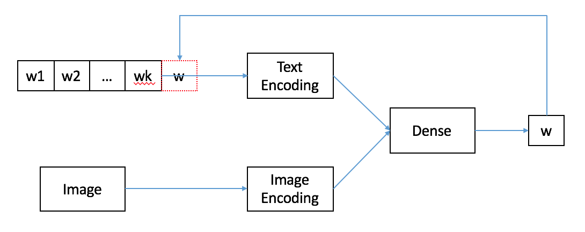

# Image caption Generation

## Problem Definition
- from given image, generate caption that desribes given image well

## Dataset
- Flicker 8k dataset
- 6000 train images, 1000 dev images, 1000 test images
- 5 captions per each image

## Inject model vs Merge model
- Inject model
    - Encoded image feature is one of the RNN input
    - image feature is tread equally with text
    - Thus, RNN does image-conditioned text generator
    - 
- Merge model
    - Encoded image feature is merged right before predict
    - RNN handles purely linguistic information
    - 

## Inject model
- implemented in `inject_model_tf.ipynb`
- 
- train time
    - given image and caption
    - add special tokens to caption
        - start of sequence(e.g. #START#)
        - end of sequence(e.g. #END#)
    - RNN input: caption[:-1]
    - RNN target: caption[1:]
- inference time
    - given image without caption
    - start from first word(e.g. #START#)
    - generated word at current timestep will be fed into next input of RNN until end of sequence(e.g. #END#) or maximum sequence length

## Merge model
- implemented in `merge_model_kears.ipynb`
- 
- train time
    - text encoding and image encoding merges right before selecting next word
    - given caption[:k], predict caption[k]
- inference time
    - given image without caption
    - start from first word(e.g. #START#)
    - generate word recursively as in `Inject model`

## tensorflow MISC
- use tf.variable_scope() and tf.get_variable()
    - to avoid creation of unintended variable
    - by default, tensorflow graph is global scope
    - tf.reset_default_graph() removes all tensor in graph
- calculate tensor shape thoroughly
    - input shape and output shape
